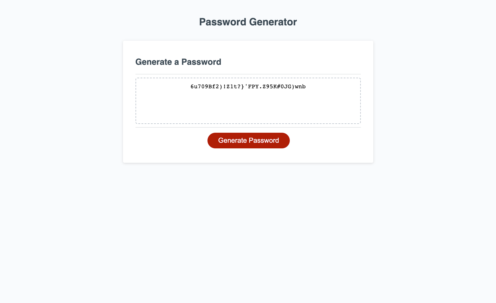

# Password-Generator
Application that generates a random password given a criteria input by the user.

This challenge demonstrates the use of javascript to interact with html and css to display a random password on the screen.

# Challenges

The main challenge was figuring out the best way to get user input and also how to make the code validate for each input.

# Things I learned

I learnt that you can use JavaScript to directly edit the html via the DOM.

# Website Screenshot

# Installation

N/A

# Usage

To use this [website](https://percyjacks.github.io/Password-Generator/), click on the 'generate password' button and answer the prompts in order to generate your desired password.

# Credits

N/A

# License

Please refer to the LICENSE in the repo.

# Contact

If you have any questions, please contact me at:

Github: [PercyJacks](https://github.com/PercyJacks)
